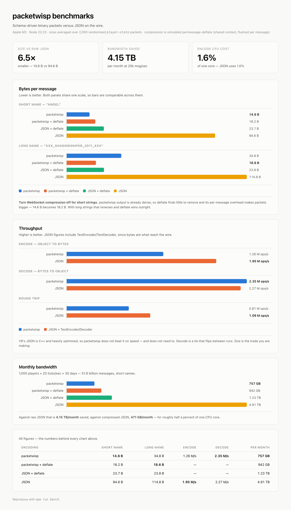

<div align="center">

# packetwisp

**Schema-driven binary packets for WebSockets.**
Describe your packet once, send 16 bytes instead of 93.

<!-- [](https://www.npmjs.com/package/packetwisp) -->
[](https://nodejs.org)
[](https://www.typescriptlang.org)
[](#license)

</div>

---

JSON over a WebSocket spends most of its bytes repeating your own field names. `packetwisp` takes a schema, assigns every packet an id, packs the fields by position, and squeezes booleans down to single bits, so the wire only carries values.

```
JSON    {"health":100,"posX":12.5,"posY":-3.25,"isAlive":true, … }   93 bytes
wisp    ██ ██ ████ ████ ██ █████                                     16 bytes
```

## Install

```bash
npm install packetwisp
```

## Quick start

```ts
import { PacketWisp } from "packetwisp";
import type { WispSchema } from "packetwisp";

const schema: WispSchema = [
  {
    name: "player-state",
    fields: {
      health: "byte",
      posX: "float32",
      posY: "float32",
      isAlive: "boolean",
      isJumping: "boolean",
      playerName: "string",
    },
  },
];

const wisp = new PacketWisp();
wisp.setSchema(schema);

// client
socket.send(wisp.encode("player-state", {
  health: 100,
  posX: 12.5,
  posY: -3.25,
  isAlive: true,
  isJumping: false,
  playerName: "angel",
}));

// server
socket.on("message", (buf) => {
  const packet = wisp.decode(buf);
  if (!packet) return;               // malformed; decode never throws
  console.log(packet.packetName);    // "player-state"
  console.log(packet.health);        // 100
});
```

> [!WARNING]
> **The schema must be identical on both sides.** `packetwisp` sends no field
> names and no layout information: only values, in schema order. The decoder
> reconstructs a packet purely from its own copy of the schema, so if the two
> copies differ in *field order, field types, field count, or packet order*, the
> decoder will read the wrong bytes into the wrong fields.
>
> This fails quietly. A mismatched schema usually still decodes, just into
> silently wrong values (swapped floats, flipped booleans, mangled strings)
> rather than raising an error. Ship both ends together, and treat any schema
> edit as a breaking change for every client still running the old one.

## Field types

| Type | Size | Notes |
|---|---|---|
| `byte` | 1 byte | unsigned, `0`–`255` |
| `float32` | 4 bytes | big-endian |
| `boolean` | 1 bit | eight booleans share one byte |
| `string` | variable | UTF-8, one per packet, always last |

Fields absent from your object encode as zero / `false`. Fields absent from the *schema* are never sent; the schema is the contract.

## Wire format

For the schema above, encoding `player-state`:

```
 byte    0        1        2 3 4 5      6 7 8 9       10           11 …
       ┌────────┬────────┬────────────┬────────────┬────────────┬──────────┐
       │ packet │ health │    posX    │    posY    │  flags     │ playerName│
       │   id   │ (byte) │  (float32) │  (float32) │ 10000000   │  (utf-8)  │
       └────────┴────────┴────────────┴────────────┴────────────┴──────────┘
                                                      │ │
                                     isAlive = true ──┘ └── isJumping = false
```

Booleans pack most-significant-bit first, in schema order. The string takes the rest of the buffer, so its length never has to be transmitted.

## API

| Method | Description |
|---|---|
| `setSchema(schema)` | Load the schema and assign packet ids. Call once, before encoding. |
| `encode(name, data)` | Returns an `ArrayBuffer`. Throws if `name` matches no schema. |
| `decode(buffer)` | Returns the packet object, or `undefined` if the buffer is malformed. |
| `getSchemaFromName(name)` | Look up a loaded schema. |

`decode` is built for untrusted input: non-buffers, truncated packets, unknown ids and random bytes all return `undefined` rather than throwing.

## Benchmarks

`npm run bench` on Apple M2, Node 22.23. Size figures are averages over 2,000
packets with randomised values; compression is simulated `permessage-deflate`
(one shared deflate context per connection, flushed per message).

<picture>
  <source media="(prefers-color-scheme: dark)" srcset="docs/benchmarks-dark.png">
  
</picture>

### Size

| | short name | long name |
|---|---|---|
| **packetwisp** | **14.6 B** | **34.8 B** |
| JSON | 94.6 B | 114.8 B |
| JSON + deflate | 23.7 B | 23.8 B |
| packetwisp + deflate | 18.2 B | 18.6 B |
| *vs raw JSON* | *6.5x smaller* | *3.3x smaller* |
| *vs deflated JSON* | *1.6x smaller* | *0.7x, deflate wins* |

> [!TIP]
> **Turn WebSocket compression off when your strings are short.** packetwisp
> output is dense, so deflate can't find much to remove and its per-message
> overhead makes packets *bigger*: 14.6 B becomes 18.2 B. Once strings get
> long, that reverses: deflate compresses the text and wins outright. Measure
> with your own payloads.

### Speed

| | packetwisp | JSON (+ TextEncoder/Decoder) | |
|---|---|---|---|
| encode | 1.26 M ops/s | 1.95 M ops/s | JSON 1.5x faster |
| decode | 2.35 M ops/s | 2.27 M ops/s | tie (flips between runs) |
| round trip | 0.81 M ops/s | 1.09 M ops/s | JSON 1.35x faster |

V8's JSON parser is written in C++ and brutally optimised, so packetwisp does
not beat it, and does not need to. At 20,000 messages/sec, encoding costs
**1.6% of one core** versus JSON's 1.0%. You are trading half a percent of a
CPU for the bandwidth numbers below.

### What that means in practice

1,000 players x 20 ticks/sec, 30 days, or 51.8 billion messages:

| | per message | per month |
|---|---|---|
| **packetwisp** | **14.6 B** | **757 GB** |
| packetwisp + deflate | 18.2 B | 942 GB |
| JSON + deflate | 23.7 B | 1.23 TB |
| JSON | 94.6 B | 4.91 TB |

**4.15 TB/month** saved against raw JSON, **471 GB/month** against compressed
JSON, while costing you half a percent of a core.

## Caveats

- **One string per packet**, and it is always written last. Schemas with more than one string field are skipped with a warning.
- **Packet ids are array indices.** Append new packets to the end of the schema; reordering it breaks every client still running the old order.
- **No range or type checking yet.** A `byte` field given `300` or `"abc"` is written as-is.
- Values are not validated on decode either: a structurally valid buffer full of garbage decodes to a packet full of garbage.

## Development

```bash
npm run example      # run src/example.ts
npm test             # vitest (52 tests)
npm run bench        # size + speed benchmarks
npm run typecheck
npm run build
```

## License

ISC
